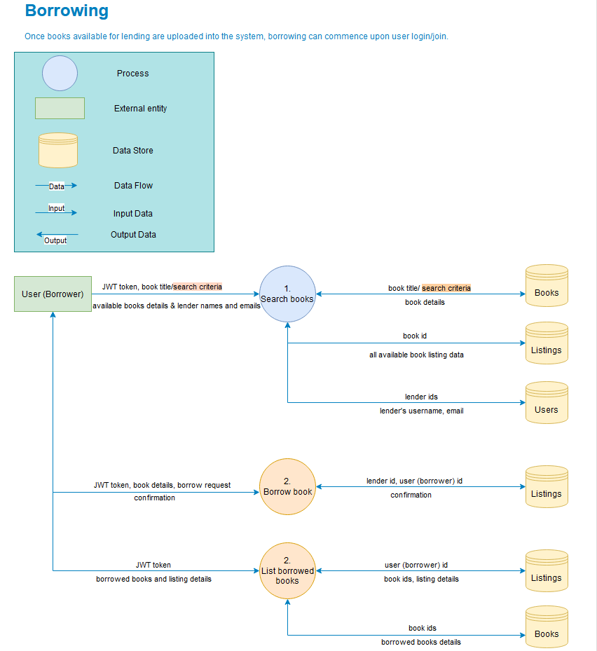

# BookSwap - Share. Swap. Explore.

## R1 - Description of the website

**Purpose:**

BookSwap is an online platform designed to connect book enthusiasts and facilitate the sharing of books within a community of readers. The primary purpose of the platform is to foster a sense of community, encourage book sharing, and provide a convenient way for users to explore and borrow books from fellow readers.

The organisation Konyvek.hu has shown interest in integrating the application into their existing platform. To facilitate this, they have assigned a resource named Jozsef to collaborate on the project. Jozsef's responsibilities include defining the project scope, participating in standup meetings, and conducting user testing.

Please note that the inclusion of Konyvek.hu as part of the context is purely fictional and has been added solely for assessment purposes.

**Functionality/Features:**

In collaboration with Jozsef, we have identified three tiers of functionality based on the applied agile methodology. These tiers define the progressive levels of features of the project. By dividing the these functionalities into tiers, we can prioritise and implement them incrementally, ensuring a focused and efficient development process. The customer expressed their satisfaction with the Minimal Value Product (MVP) scope and stated that any additional features implemented would be considered a bonus.

1. Minimal Value Product

- User Registration: Users can sign up and create an account.
- User Login: Users can log in to access their account.
- Book Listing Management for Lenders: Lenders can create, list, update, and delete their book listings.
- Book Search for Borrowers: Borrowers can search for books based on the title and view basic book information and lender email.
- Borrowers can contact lenders externally via email for borrowing requests.

2. Advanced functionalities

- Advanced Book Search: Borrowers can search for books using various search criteria.
- Borrowing Requests: Borrowers can send borrowing requests through the app.
- Request Management for Lenders: Lenders can accept or deny borrowing requests within the app.
- Requested Books Listing: Borrowers can view the list of their borrowed books.
- Request Status for Borrowers: Borrowers can view the status of their borrowing requests within the application.
- Book Status Tracking: Book status will be color-coded based on due dates for both the lenders and borrowers.
- Lenders can contact the borrowers instead the other way around via external email.
- Advanced Listing: Book information will be pre-filled based on the title if it was previously added to the database.

3. Nice to have functionalities

- Detailed Book Information: Lenders can provide and borrowers can view detailed book information, including descriptions and book condition.
- Account Management: Users can manage their account settings, such as changing their password or email address.
- Integration with an API for book data to autofill book details.
- Internal messaging system between borrowers and lenders.
- Users can rate and provide feedback on borrowed books.
- Administrator functionality (manage user accounts, moderate listings, admin dashboard).

**Target Audience:**

The target audience for BookSwap includes book enthusiasts and avid readers who are interested in sharing and borrowing books within a community. It caters to individuals who are looking for an online platform to connect with like-minded readers and access a diverse range of books.

**Tech Stack:**

| Category          | Tools                                                                                   |
|-------------------|-----------------------------------------------------------------------------------------|
| Front-end         | HTML5, CSS3, JavaScript, [React.js](https://reactjs.org/), [Bootstrap](https://getbootstrap.com/), [React-Bootstrap](https://react-bootstrap.github.io/) |
| Back-end          | [Node.js](https://nodejs.org/en/), [Express.js](https://expressjs.com/), [Mongoose](https://mongoosejs.com/)   |
| Database          | [MongoDB](https://www.mongodb.com/)                                                     |
| Hosting           | [Netlify](https://www.netlify.com/), [Heroku](https://www.heroku.com/), [MongoAtlas](https://www.mongodb.com/atlas/database)                 |
| Testing           | [Jest](https://jestjs.io/)                                                               |
| Project Management| [Trello](https://trello.com), [Scrum](https://www.scrum.org/) , [Zoom](https://zoom.us/)                          |
| DevOps Tools      | [GitHub Desktop](https://desktop.github.com/), [GitHub](https://github.com/), [VS Code](https://code.visualstudio.com/)     |
| Design Tools      | [Figma](https://www.figma.com), [Logo](https://logo.com/), [Draw.io](https://app.diagrams.net/)                           |

## R2 - Dataflow Diagram

The data flow diagram incorporates the following aspects as agreed upon with Jozsef:
The inclusion of these elements enhances the clarity and comprehensiveness of the data flow diagram, ensuring that it effectively captures the desired processes and interactions within the system.

1. Diagram Separation: To ensure clarity and avoid clutter, the data flow diagrams are separated into distinct sections for signup-login, lending, and borrowing processes.
2. Happy Path: The diagram primarily captures the ideal flow of data during the various processes. However, it is essential to include error handling mechanisms to account for potential exceptions and error scenarios in the code.
3. MVP and Advanced Scope: The diagram encompasses both the Minimum Viable Product (MVP) and the Advanced scope elements. To distinguish the advanced scope components, they are highlighted in orange, indicating additional features beyond the MVP.
4. Process Orders: The diagram denotes the sequence of processes by assigning them numbers. Processes sharing the same number signify that any of them can commence at that point in the flow.
5. Multiple Queries and Database Order: In scenarios where multiple queries are required to fulfill a request, the diagram demonstrates the order (top to bottom) in which the database operations are executed. For instance, in the context of retrieving borrowed books, the diagram demonstrates the initial querying of the listings collection. Subsequently, utilising the gathered book IDs, a query to the book collection is executed to obtain the relevant details of those books. Finally, the acquired book details are retrieved and sent back to the backend for further processing.

## R3 - Application Architecture Diagram

## R4 - User Stories

For the BookSwap application project with my client Konyvek.hu, we have adopted Scrum methodology to ensure an iterative and collaborative development process. Jozsef has been working closely with me to define and prioritise user stories that align with the project's goals. In our initial discussions, we identified a set of high-level user stories with 3 different personas (lender, borrower and admin) that served as a starting point for our work. As part of our agreement, we decided to prioritise and define the list of functionalities by assigning numbers to establish the order. This approach allows for transparency and incremental development to be implemented effectively. In addition to user stories, I will also define technical stories on the Trello Board to address specific technical aspects of the project.
To determine the scope of the Minimum Viable Product (MVP), we engaged in further discussions the following day to identify the user stories that are essential for the initial launch and would satisfy the customer's requirements. During these discussions, we finalised the user stories for the Minimal Viable Product (MVP). These user stories encompass functionalities designed to cater to both lenders and borrowers. It was also acknowledged that further changes could arise during the wireframing and flow diagramming process.

### Minimal Value Product

1. As a **lender**, I want to be able to sign up to the bookSwap platform so that I can manage my book listings.
2. As a **lender**, I want to be able to log in to the bookSwap platform so that I can manage my book listings.
3. As a **borrower**, I want to be able to sign up to the bookSwap platform so that I can find books that can be borrowed.
4. As a **borrower**, I want to be able to log in to the bookSwap platform so that I that I can find books that can be borrowed.
5. As a **lender**, I want to create a book listing, so that I can share information about the books I have available for borrowing.
6. As a **lender**, I want to view all my books listed, making it easy for me to see and manage them.
7. As a **lender**, I want the ability to edit the details of my listed books, such as the title, author, and availability, so that I can keep the information up to date.
8. As a **lender**, I want to delete a listed book, so that I can remove books that are no longer available for borrowing.
9. As a **borrower**, I want to be able to search for books by title that are available for borrowing, allowing me to find books that match my interests.
10. As a **borrower**, I want to view basic book information and the lender's email, so that I can contact them externally via email for borrowing requests.

Building upon the MVP, we also discussed additional functionalities during our subsequent meetings, which are categorised as advanced features.

### Advanced features

11. As a **borrower**, I want to search for books using various criteria (e.g., title, author, year), so that I can find books more accurately and efficiently.
12. As a **borrower**, I want to send borrowing requests through the app, so that I can easily communicate my interest in borrowing a specific book.
13.	As a **lender**, I want to receive borrowing requests within the app, so that I can conveniently manage and respond to requests.
14.	As a **lender**, I want to accept and provide due date or deny borrowing requests within the app, so that I can control the lending process and communicate my decision to borrowers.
15.	As a **borrower**, I want to list my borrowed books list, so that I can track them.
16.	As a **borrower**, I want to view the status of my borrowing requests within the application, so that I can know whether my request is accepted, or denied.
17.	As a **user**, I want the book status to be color-coded based on due dates, so that I can easily identify overdue books and those close to the due date.
18.	As a **lender**, I want to communicate with borrower externally via email for lending details, meeting arrangements, and other discussions.
19.	As a **lender**, I want the system to auto-fill the information of a book if that is added to the database previously, so the listing would be faster and more convenient.

Additionally, we briefly discussed future nice-to-have plans, which are defined at a higher level compared to the MVP and advanced functionalities fit to the agile eco-system.

### Nice to haves (these user stories are defined on high level)

20. As a **lender**, I want to provide more information about the book including condition, description, so the borrower can make an informed decision about borrowing and minimise disputes.
21. As a **borrower**, I want to view detailed book information, including descriptions and book condition, so that I can make informed decisions about borrowing.
22.	As a **user**, I want to manage my account settings, so that I can update my profile information, change my password, and modify my email or delete my account.
23.	As a **lender**, I want the platform to integrate with an external API for book data, so that book details can be auto filled based on title or other identifiers, saving time when creating listings.
24.	As a **user**, I want an internal messaging system between borrowers and lenders within the app, so that I can conveniently communicate and discuss lending details without relying on external email.
25.	As a **borrower**, I want to rate and provide feedback on borrowed books, so that I can share my experience and help others make informed decisions.
26.	As an **administrator**, I want to manage user accounts, moderate listings, and have access to an admin dashboard, so that I can ensure the smooth operation of the platform and handle any necessary administrative tasks.

Following the definition of the user stories, we utilise Trello as a project management tool to create task cards for the MVP and advanced user stories and a collection to the nice to haves. By adopting this approach, we will be able to efficiently monitor and oversee the development process. As the project progresses, each user story will be further broken down into actionable steps. It is important to note that changes are a natural part of the process, and as such, the Trello Board will be continuously refined to accommodate any modifications.

## R5 - Wireframes

## R6 - Trello Board

[bookSwap Trello Board](https://trello.com/b/BfJSkwUq/bookswap)

Initial setup of the Trello Board for the documentation of the project.

The following working day the documentation progress

After the user story discussions the Trello Board was set up with the agreed user stories.

