# BookSwap - Share. Swap. Explore

[BookSwap Project Documentation Repository](https://github.com/KrisztaT/bookswap
)

[BookSwap Client Repository](https://github.com/KrisztaT/bookswap-client)

[BookSwap Server Repository](https://github.com/KrisztaT/bookswap-server)

[BookSwap Deployed Client](https://bookswap-client.netlify.app/)

[BookSwap Deployed Server](https://bookswap-server-kt-2962369e5914.herokuapp.com/)

Note: To facilitate easier identification throughout the documentation, updates,changes and tasks specific to Part B of the project are marked with the 'B' identifier.

## R1 - Description of the website

**Purpose:**

BookSwap is an online platform designed to connect book enthusiasts and facilitate the sharing of books within a community of readers. The primary purpose of the platform is to foster a sense of community, encourage book sharing, and provide a convenient way for users to explore and borrow books from fellow readers.

The organisation Konyvek.hu has shown interest in integrating the application into their existing platform. To facilitate this, they have assigned a resource named Jozsef to collaborate on the project. Jozsef's responsibilities include defining the project scope, participating in standup meetings, and conducting user testing.

Please note that the inclusion of Konyvek.hu as part of the context is purely fictional and has been added solely for assessment purposes.

**Functionality/Features:**

In collaboration with Jozsef, we have identified three tiers of functionality based on the applied agile methodology. These tiers define the progressive levels of features of the project. By dividing the these functionalities into tiers, we can prioritise and implement them incrementally, ensuring a focused and efficient development process. The customer's requirement is to prioritize addressing the MVP tier, while considering any additional implemented functionalities in the Advanced or Nice to have tiers as valuable extras and part of the longer-term development scope.

### 1. Minimal Value Product

- User Registration: Users can join and create an account to access the functionalities of the application.
- User Login: Users can log in to access the functionalities of the application.
- User Logout: Users can log out to ensure the protection and privacy of their information and prevent unauthorised access.
- Add and Edit Books: Lenders can add books to the database of BookSwap and edit their details.
- Book Listing Management for Lenders: Lenders can create, list, update their status, and delete their book listings.
- Book Search for Borrowers: Borrowers can search for books based on the title and in the result list view basic book information and lender's name and email.
- Borrowers can contact lenders externally via email for communicating about lending details.

### 2. Advanced functionalities

- Additional Information for Listed Books: Lenders can provide additional details such as location and condition for their listed books.
- Advanced Book Search: Borrowers can search for books using various search criteria.
- Borrowing Requests: Borrowers can send borrowing requests through the app.
- Requested Books in Lender's List: Lenders can conveniently view requested books within their listed books section
- Request Management for Lenders: Lenders can accept or deny borrowing requests within the app.
- Requested Books Listing: Borrowers can view the list of their borrowed books.
- Request Status for Borrowers: Borrowers can view the status of their borrowing requests within their borrowed books list.
- Book Status Tracking: Book status will be color-coded based on due dates for both the lenders and borrowers.
- Lenders can contact the borrowers instead the other way around via external email.
- Book Image Upload: Lenders have the ability to upload images of books from their computer.
- Advanced Listing: Book information will be pre-filled based on the title if it was previously added to the database.

### 3. Nice to have functionalities

- Detailed Book Information: Lenders can provide and borrowers can view detailed book information, including descriptions.
- Account Management: Users can manage their account settings, such as changing their password or email address.
- Integration with an API for book data to autofill book details.
- Internal messaging system between borrowers and lenders.
- Users can rate and provide feedback on borrowed books.
- Administrator functionality (manage user accounts, moderate listings, admin dashboard).

**Target Audience:**

The target audience for BookSwap includes book enthusiasts and avid readers who are interested in sharing and borrowing books within a community. It caters to individuals who are looking for an online platform to connect with like-minded readers and access a diverse range of books.

**Tech Stack:**

| Category          | Tools                                                                                   |
|-------------------|-----------------------------------------------------------------------------------------|
| Front-end         | HTML5, CSS3, JavaScript, [React.js](https://reactjs.org/), [Bootstrap](https://getbootstrap.com/), [React-Bootstrap](https://react-bootstrap.github.io/) |
| Back-end          | [Node.js](https://nodejs.org/en/), [Express.js](https://expressjs.com/), [Mongoose](https://mongoosejs.com/)   |
| Database          | [MongoDB](https://www.mongodb.com/)                                                     |
| Hosting           | [Netlify](https://www.netlify.com/), [Heroku](https://www.heroku.com/), [MongoAtlas](https://www.mongodb.com/atlas/database)                 |
| Testing           | [Jest](https://jestjs.io/)                                                               |
| Project Management| [Trello](https://trello.com), [Scrum](https://www.scrum.org/) , [Zoom](https://zoom.us/)                          |
| DevOps Tools      | [GitHub Desktop](https://desktop.github.com/), [GitHub](https://github.com/), [VS Code](https://code.visualstudio.com/)     |
| Design Tools      | [Figma](https://www.figma.com), [Logo](https://logo.com/), [Draw.io](https://app.diagrams.net/)                           |

## B - Implemented functionalities updates

As the implementation progressed using scrum, the descriptions naturally evolved, leading to minor adjustments in order to accurately describe the functionalities.

### 1. Minimal Value Product

- User Registration: Users can join and create an account to access the functionalities of the application.
- User Login: Users can log in to access the functionalities of the application.
- User Logout: Users can log out to ensure the protection and privacy of their information and prevent unauthorised access.
- **Add and Edit Books: Lenders can add books to the database of BookSwap and have the option to edit the details of the books they have contributed to the database.**
- Book Listing Management for Lenders: Lenders can create, list, update their status, and delete their book listings.
- Book Search for Borrowers: Borrowers can search for books based on the title and in the result list view basic book information and lender's name and email.
- Borrowers can contact lenders externally via email for communicating about lending details.

### 2. Advanced functionalities

- Additional Information for Listed Books: Lenders can provide additional details such as location and condition for their listed books.
- **Enhance Additional Information: Lenders can update the extra provided data as needed.**
- Advanced Book Search: Borrowers can search for books using various search criteria.
- **Search result is updated with to display the additional data.**

## B - Libraries used in the project

### Server Libraries

`bcrypt (^5.1.0)`: Bcrypt is used for hashing passwords and it provides a secure way to hash and compare passwords, making it difficult for attackers to reverse-engineer the original passwords from the hashes.

`cors (^2.8.5)`: CORS (Cross-Origin Resource Sharing) is a security feature that allows or restricts web resources (such as APIs) to be requested from different domains. The cors library helps in handling CORS headers and settings, making it easier to control and secure the communication between the app's frontend and backend. It's important to note that the application is configured to operate within the local context of "http://localhost:3000" in case of local run. For the application to function correctly from alternative hosts, configuration adjustments are required in both the backend and frontend.

`dotenv (^16.3.1)`: Dotenv allows the load of environment variables from a .env file into the app's process environment. It is used to keep sensitive configuration details (like database URLs, API keys, etc.) separate from the codebase and safely stored.

`express (^4.18.2)`: Express.js is a framework designed for Node.js that streamlines the development of powerful and scalable web applications and APIs. It offers a comprehensive set of tools for managing routes, handling requests and responses, implementing middleware, and other essential functionalities required for building this application.

`express-validator (^7.0.1)`: The express-validator library is utilised to validate and sanitise incoming request data in applications. It plays a crucial role in mitigating common security vulnerabilities such as cross-site scripting (XSS) and SQL injection by sanitising user inputs. This library was used to validate data from frontend forms related to login, join, book, and listing functionalities.

`helmet (^7.0.0)`: Helmet is a security middleware that enhances the security of an application by configuring various HTTP headers. These headers help guard against prevalent security threats, including Cross-Site Scripting (XSS) attacks, clickjacking, and others.

`jsonwebtoken (^9.0.1)`: The jsonwebtoken library enables the generation and verification of JSON Web Tokens (JWTs), which serve as a secure and efficient method for exchanging claims between two parties. JWTs are commonly used in web applications to implement authentication and authorisation mechanisms.

`mongoose (^7.3.2)`: Mongoose is a library that serves as an Object Data Modeling (ODM) tool for MongoDB and Node.js. It offers a schema-based interface for interacting with MongoDB databases, simplifying the process of defining models, querying data, and executing Create, Read, Update, and Delete (CRUD) operations.

`Jest (^29.6.1)`: Jest is a testing framework for JavaScript applications and offers a set of testing tools, to help ensuring the quality and accuracy of the code.

`Nodemon (^3.0.1)`: Nodemon is a utility tool used in development that watches for modifications in the source code and automatically restarts the server when changes are detected.

`Supertest (^6.3.3)`: Supertest is a library for testing HTTP endpoints, it enables sending HTTP requests to apps's API routes and assert the responses, simplifying the process of writing automated tests for the API endpoints.

### Client Libraries

`bootstrap (^5.3.0)`: Bootstrap is a CSS framework that offers a collection of pre-designed and responsive UI components. It streamlines the process of designing visually appealing and consistent user interfaces for web applications.

`framer-motion (^10.12.18)`: Framer Motion is a library for adding smooth and interactive animations to React components. It provides an intuitive API for creating animations and transitions, enhancing the visual appeal and user experience of the apps.

`react (^18.2.0)`: React is a JavaScript library for building user interfaces. It allows developers to create reusable UI components and manage the dynamic rendering of data.

`react-bootstrap (^2.8.0)`: React Bootstrap is an adaptation of the Bootstrap framework for use with React applications. It provides a set of pre-styled components that are integrated with React's component architecture, enabling efficient UI development.

`react-bootstrap-icons (^1.10.3)`: This library offers a collection of Bootstrap icons as individual React components. It allows easy integration of icons into React components and UI elements.

`react-dom (^18.2.0)`: React DOM is a package that provides the methods and components necessary for rendering React applications in the browser. It facilitates the interaction between React components and the actual HTML DOM.

`react-router-dom (^6.14.1)`: React Router DOM is a library for adding routing and navigation capabilities to React applications. It allows the creation of multi-page apps by defining routes and managing the rendering of different components based on the URL.

`@testing-library/jest-dom (^5.16.5)`: The Jest DOM library extends the capabilities of Jest for asserting DOM-related expectations in tests.

`@testing-library/react (^13.4.0)`: Testing Library for React is a testing framework that emphasises testing user interactions and behavior rather than implementation details. It provides utilities for simulating user actions and asserting the resulting state and rendered output of React components.

`@testing-library/user-event (^13.5.0)`: This library complements Testing Library by simulating user interactions, such as clicks, typing, and focusing, in a way that closely resembles how a real user interacts with a web application.

## R2 - Dataflow Diagram

The data flow diagram incorporates the following aspects as agreed upon with Jozsef:
The inclusion of these elements enhances the clarity and comprehensiveness of the data flow diagram, ensuring that it effectively captures the desired processes and interactions within the system.

1. Diagram Separation: To ensure clarity and avoid clutter, the data flow diagrams are separated into distinct sections for signup-login, lending, and borrowing processes.
2. Happy Path: The diagram primarily captures the ideal flow of data during the various processes. However, it is essential to include error handling mechanisms to account for potential exceptions and error scenarios in the code.
3. MVP and Advanced Scope: The diagram encompasses both the Minimum Viable Product (MVP) and the Advanced scope elements. To distinguish the advanced scope components, they are highlighted in orange, indicating additional features beyond the MVP.
4. Process Orders: The diagram denotes the sequence of processes by assigning them numbers. Processes sharing the same number signify that any of them can commence at that point in the flow.
5. Multiple Queries and Database Order: In scenarios where multiple queries are required to fulfill a request, the diagram demonstrates the order (top to bottom) in which the database operations are executed. For instance, in the context of retrieving borrowed books, the diagram demonstrates the initial querying of the listings collection. Subsequently, utilising the gathered book IDs, a query to the book collection is executed to obtain the relevant details of those books. Finally, the acquired book details are retrieved and sent back to the backend for further processing.

## B - Dataflow Diagram update

As the implementation progressed, it became evident that the book and listing data are inherently connected, given that a listing cannot exist without an associated book. Despite this interdependence, the need for distinct schemas-models arose to address scenarios where a single book representation could be listed by multiple lenders, each with unique lending information.

Initially, an attempt was made to manage these elements separately; however, this approach introduced unnecessary complexities on both the front and backend. Consequently, a decision was reached to separate the book and listing data within the database while continuing to manage them together on both frontend and backend platforms.

As a result, modifications were made to the lending data flow diagram that is  presented below.

## R3 - Application Architecture Diagram

Regarding the architecture, the client requested a high-level overview that encompasses the various technologies involved in building a full stack application. The emphasis was placed on understanding the overall structure rather than delving into specific features. Additionally, Jozsef asked for a concise description to facilitate better comprehension of the tasks performed by the client, server, and database components.

The MERN stack architecture is a popular web development stack that consists of four key components: MongoDB, Express.js, React, and Node.js.

- **Client (React)**
In terms of the architecture, the client plays a crucial role as the front-end component of the application. It takes charge of rendering the user interface, handling user interactions, and facilitating site navigation. By utilising React, a powerful JavaScript library for building user interfaces, the client creates reusable components and effectively manages the application's state.
To exchange data with the server, the client communicates through API requests. These requests are used to retrieve data from the server or trigger specific actions. By sending these requests, the client can fetch the necessary information from the server's back-end.

- **Server (Node.js with Express.js, Mongoose)**
The server is built using Node.js, a JavaScript runtime, and Express.js, a web application framework for Node.js. The server handles incoming requests from the client, processes them, and returns responses. Express.js provides an organised way to define routes, controllers, and middlewares. Routes define the API endpoints, controllers handle the logic for each route, and middlewares perform tasks such as authentication or request parsing and so on. Mongoose is an Object Data Modeling (ODM) library for Node.js that provides a higher-level abstraction for MongoDB. It allows the definition of schemas and models to structure and interact with the data stored in MongoDB. Mongoose simplifies tasks like validation, querying, and performing operations on the database.

- **Database (MongoDB)**
MongoDB is a NoSQL database that stores data in flexible, JSON-like documents. It is used for persistent data storage in the MERN stack.

According to the current plan, the client application will be hosted on Netlify, the server will be hosted on Heroku, and the database will be hosted on MongoDB Atlas.

## R4 - User Stories

For the BookSwap application project with my client Konyvek.hu, we have adopted Scrum methodology to ensure an iterative and collaborative development process. Jozsef has been working closely with me to define and prioritise user stories that align with the project's goals. In our initial discussions, we identified a set of high-level user stories with 3 different personas (lender, borrower (together user) and admin) that served as a starting point for our work. As part of our agreement, we decided to prioritise and define the list of functionalities by assigning numbers to establish the order. This approach allows for transparency and incremental development to be implemented effectively. In addition to user stories, I will also define technical stories on the Trello Board to address specific technical aspects of the project.
To determine the scope of the Minimum Viable Product (MVP), we engaged in further discussions the following day to identify the user stories that are essential for the initial launch and would satisfy the customer's requirements. During these discussions, we finalised the user stories for the Minimal Viable Product (MVP). These user stories encompass functionalities designed to cater to both lenders and borrowers. It was also acknowledged that further changes could arise during the wireframing and flow diagramming process.

### Minimal Value Product

1. As a **user**, I need an informative landing page to evaluate the BookSwap platform and make an informed decision about joining.
2. As a **user**, I want to be able to join BookSwap platform, so that I can access and utilise its features.
3. As a **user**, I want to be able to log into BookSwap platform, so that I can access and utilise its features.
4. As a **lender**, I want the ability to add new books to the BookSwap database if they are not already added, so I can add them to my listings.
5. As a **lender**, I want to edit the details of the books I have added to the database on BookSwap so that I can rectify any mistakes or inaccuracies.
6. As a **lender**, I want to create a book listing, so that I can share books I have available for borrowing.
7. As a **lender**, I want to view all my books listed, making it easy for me to see and manage them.
8. As a **lender**, I want the ability to edit the status of my listed books, so it will be clear to everyone when they are available.
9. As a **lender**, I want to delete a book from my listing, so that I can remove books that are no longer available for borrowing.
10. As a **borrower**, I want to be able to search for books by title that are available for borrowing, allowing me to find books that match my interests.
11. As a **borrower**, I want a clear display of search results that shows all available copies of books from different lenders, so I can make a decision on which book to borrow.
12. As a **borrower**, I want to view basic book information and the lender’s name and lender's email, so that I can contact them externally via email for borrowing requests.
13. As a **user**, I want the ability to securely log out of the application, ensuring that my platform details remain protected and inaccessible to unauthorised individuals.
14. As a **user** I would like to be able to navigate between the pages, so I can utilise every functionality.

Building upon the MVP, we also discussed additional functionalities during our subsequent meetings, which are categorised as advanced features.

### Advanced features

15. As a **lender**, I want  to provide additional information such as location and condition for my listed books, so it will be easier for borrowers to make more informed decisions.
16. As a **borrower**, I want to search for books using various criteria (e.g., title, author, location), so that I can find books more accurately and efficiently.
17. As a **borrower**, I want to request a book for borrowing through the app, so that I can easily communicate my interest in borrowing a specific book.
18. As a **lender**, I want to see requested books in my listed books section, so that I can conveniently manage and respond to requests.
19. As a **lender**, I want to accept or deny borrowing requests within the app, so that I can control the lending process and communicate my decision to borrowers.
20. As a **lender**, I want to the system to automatically set the due date to 3 weeks from now and list the borrower’s name and email address on the card, so I can communicate with borrower externally via email for lending details, meeting arrangements, and other discussions.
21. As a **borrower**, I want to list my borrowed books, so that I can track them.
22. As a **borrower**, I want to view the status of my borrowing requests in my borrowed books list, so that I can know whether my request is accepted.
23. As a **user**, I want the book status to be color-coded based on due dates, so that I can easily identify overdue books and those close to the due date.
24. As a **lender**, I would like the ability to upload images of books from my computer, so that I can have more options where images are sourced.
25. As a **lender**, I want the system to auto-fill the information of a book if that is added to the database previously, so the listing would be faster and more convenient.

Additionally, we briefly discussed high-level details of future nice-to-have plans, which are compared to the MVP and advanced functionalities and are well-suited to the agile ecosystem.

### Nice to haves (these user stories are defined on high level)

26. As a **lender**, I want to provide more information about the book including condition, description, so the borrower can make an informed decision about borrowing and minimise disputes.
27. As a **borrower**, I want to view detailed book information, including descriptions and book condition, so that I can make informed decisions about borrowing.
28. As a **user**, I want to manage my account settings, so that I can update my profile information, change my password, and modify my email or delete my account.
29. As a **lender**, I want the platform to integrate with an external API for book data, so that book details can be auto filled based on title or other identifiers, saving time when creating listings.
30. As a **user**, I want an internal messaging system between borrowers and lenders within the app, so that I can conveniently communicate and discuss lending details without relying on external email.
31. As a **borrower**, I want to rate and provide feedback on borrowed books, so that I can share my experience and help others make informed decisions.
32. As an **administrator**, I want to manage user accounts, moderate listings, moderate books, and have access to an admin dashboard, so that I can ensure the smooth operation of the platform and handle any necessary administrative tasks.

Following the definition of the user stories, we utilise Trello as a project management tool to create task cards for the MVP and advanced user stories and a collection to the nice to haves. By adopting this approach, we will be able to efficiently monitor and oversee the development process. As the project progresses, each user story will be further broken down into actionable steps. It is important to note that changes are a natural part of the process, and as such, the Trello Board will be continuously refined to accommodate any modifications.

## B - User stories updates

Throughout the implementation process, user stories organically evolved in response to the emerging information and insights. As a result, the following modifications were  accepted and integrated into the application.

10. As a **borrower**, I want to be able to search for books by title that are available for borrowing, allowing me to find books that match my interests.

- Updated from available to all to account for scenarios in which a single listed book could potentially be borrowable in the future, even if it's not immediately accessible. This adjustment ensures that users are aware of the book's presence within the application, even when it's currently borrowed.
    - As a **borrower**, I want to be able to search for books by title to borrow, allowing me to find books that match my interests.

As a result of incorporating additional details into the listings, it became necessary to introduce two new user stories:

15.b. As a **lender**, I want to edit the additional information such as location and condition for my listed books, so I can provide up-to-date extended information to borrowers.  
16.b As a **borrower**, I want to see extended information about the listed books (e.g., location, condition), so that I can find books more accurately and efficiently.

Furthermore, two change requests were successfully executed:

- The addition of a book to the listing now **only mandates the inclusion of the title, author, location and condition.** (CR1.) Beforehand the image Url, page and release year were also mandatory.
    - The application operates as follows: When a user submits the Add Book to Swap Listing form, they input the book's information (where title and author are required only) along with listing particulars. If the database identifies a book with matching title and author, connected data is presented on the cards. However, if the book is new to the database, lenders can later add the details on the listed cards by editing other information (image url, page, release year).

- Change the order of AddBook and LenderListing, incorporating a card at the forefront of LenderListing that **describe guidance on adding a book**, along with a direct link to the section. This was initiated with CR2., which was subsequently reverted in CR3., leading to the implementation of the CR4. solution. CR4. allows users to navigate to the add book form for easy access.

Implemented user stories are available for reference on the Trello board.

## R5 - Wireframes

[BookSwap wireframes plan](https://www.figma.com/file/mGdliIbudJmbZTl0WUdvfE/bookSwap?type=design&node-id=0%3A1&mode=design&t=oiaLIOWpWt9wgLaB-1)  
[BookSwap wireframes implemented](https://www.figma.com/file/7ZBxOuQQCnpehCSvLL0ZEa/bookSwap_finished?type=design&node-id=0-1&mode=design&t=dMBEuIfGqRTjpyEY-0)

In collaboration with Jozsef, the wireframes were developed, incorporating the following overarching requirements obtained during our initial meeting:

1. High-fidelity wireframes to facilitate the client's visualisation of the final product, with the acknowledgement that changes might occur. It's common for design discrepancies to arise when transitioning from a high fidelity wireframe to the coded application for reasons such as limitations in technology, responsiveness issues, or the wireframe does not always accurately represent the dynamic nature of the final product. Hence, wireframes are used as reference.
2. The focus is on developing dedicated, targeted pages that cater to specific role based actions, like lending or borrowing, enabling users to complete all related tasks on a single page without the need to navigate through multiple different pages.
3. Advanced features are incorporated and visually distinguished in the wireframes through the use of orange highlighting or an orange frame.
4. Representation of various card states, including pending, accepted, overdue, and other relevant statuses, within the wireframe designs.

In order to ensure efficiency and adherence to the agile methodology, the wireframes presented below were developed through multiple iterations and meetings, closely aligned with the user stories for the development process. During these iterations options such as presenting book information in a table format or to present content on spreading out on separate pages were explored. Table format was not suitable for mobile view and the customer expressed a preference for a concise design that avoids the use of many separate pages. Furthermore, it was necessary to redesign the cards, particularly in tablet view, as the aspect ratio was significantly different from that of the search and book add forms, leading to readability issues with the cards.

Below the mobile view frames showcases the high-level connections between the pages and their functionalities incorporated. For optimal clarity, please open the image using an image viewer.

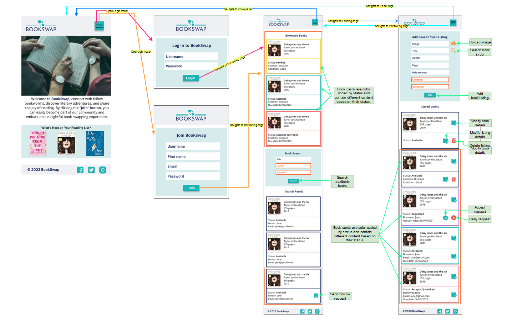

Note: Connections using prototyping are also defined in the Figma version.

### Home Page

The home page features a navigation bar that displays the site's logo, along with login and join buttons. Placing these buttons in the navigation bar ensures easy access, as the login process is essential for utilising the application. Furthermore, the home page also includes an image, an introduction, and a book section. These elements are for providing users with a clear understanding of the page's purpose and content.
For easy contact with the company, the footer of every page includes social media icons.

- Note: the social media icons in the footer are only for display, they are not functional

| Desktop | Tablet | Mobile |
|---------|--------|--------|
||  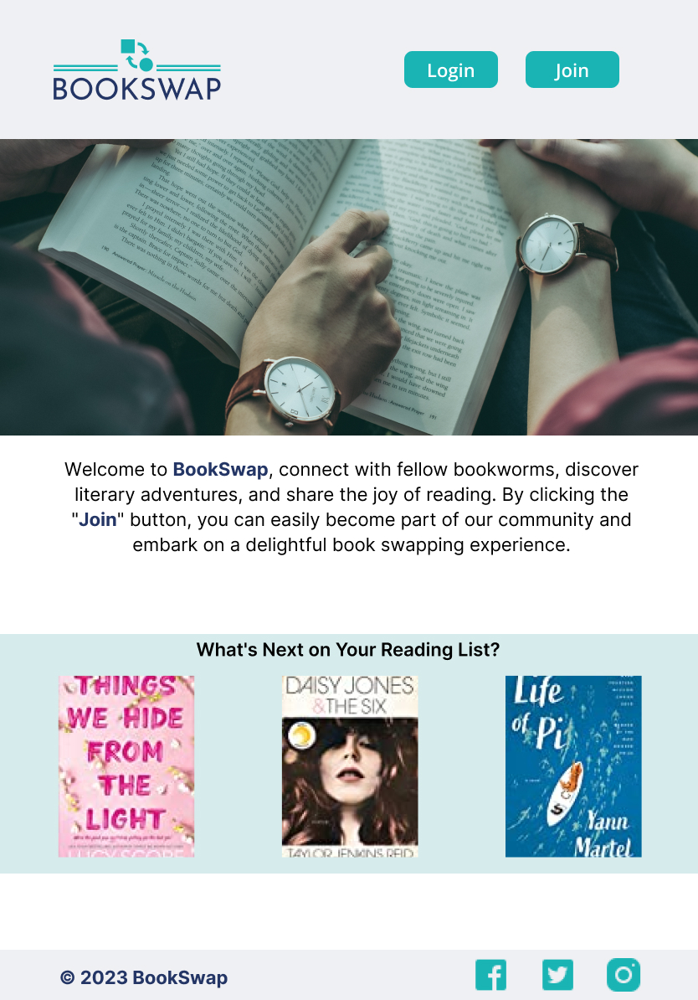      |        |

### Login and Join modal

The login and join process on the page is facilitated through the use of modals, which are displayed above the home page content upon clicking on the login or join button. This choice ensures that the modals are brought to the forefront, emphasising their importance in the user journey. Additionally, it enhances user convenience by keeping them within the context of the current page, eliminating the need for navigation to a different location which saves time and effort for users while providing visual continuity. Likewise, users can easily toggle between login and signup within the same interface, providing a cohesive and intuitive experience.

| Desktop | Tablet | Mobile |
|---------|--------|--------|
||  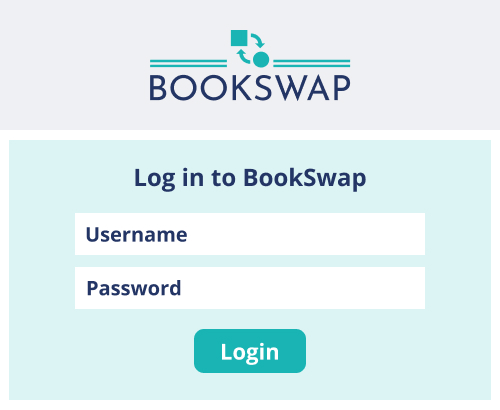      |        |

| Desktop | Tablet | Mobile |
|---------|--------|--------|
||  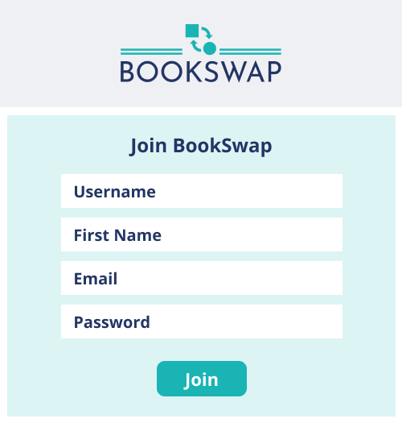    |  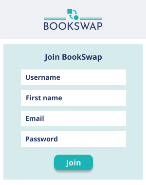      |

### Borrowing Page

As per the client's request, when users log in or join, they are directed to the borrowing page as based on client's data it is highly likely that more users are borrowers than lenders. After completing the login-join process, the navigation bar dynamically updates to display menu items and a logout icon, ensuring convenient user navigation. Within the advanced scope of the application, the top section of the page features a concise display of the borrowed books list. Given the standardised borrowing period of 3 weeks, typically no more than 2-3 books are showcased here at the same time. This efficient presentation ensures that the borrowed books list does not occupy excessive space, hence the placement.
For the borrowing page, a card-based display is used, providing a user-friendly interface. Depending on the status of the borrowing process (pending, accepted, or overdue), the card dynamically presents different borrowing information to the borrower. This tailored approach enhances the clarity and relevance of the displayed information and keep everything in the same page as was requested.
Below the borrowing section, a book search form is positioned, allowing users to search for and list available books. This search functionality enables users to quickly locate desired books from the collection. Moreover, within the advanced scope of the application, borrowers also have the capability to send borrow requests directly to the lenders.

| Desktop | Tablet | Mobile |
|---------|--------|--------|
||  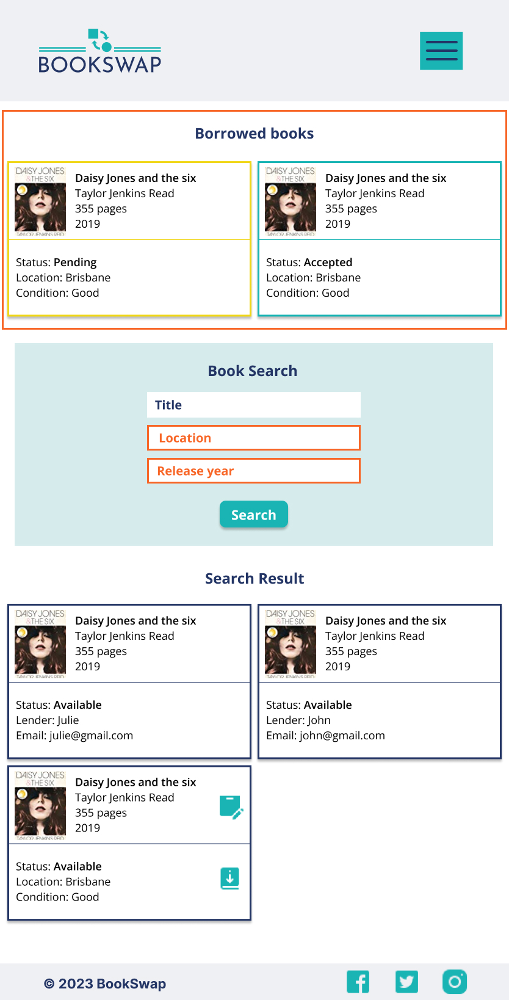    |  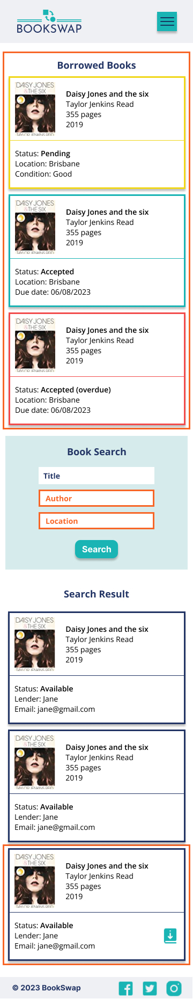      |

### Lending Page

A book adding form has been implemented alongside the book listings on the lending page. This form allows users to add books to the collection if they are not already included. Below the form, users can find their listed books. Initially, separate tables were created to list the added books and for tracking book requests states. However, this approach proved to be less user-friendly on mobile devices and resulted in a visually complex page layout. Consequently, an alternative solution was sought.
The current card-based solution provides an intuitive and user-friendly interface. The use of color coding aids users in quickly identifying the state of each card, which is crucial information for lending purposes. For instance, if a book is overdue, the book card border is highlighted in red. Additionally, depending on the status, the lending information section of the card presents relevant details. For example, if a book is requested, the card border is purple, and it displays the borrower's name and request date, along with accept and deny icons. Notably, lenders have the ability to modify book details and their own listing information. However, within the "nice to have" scope, only administrators are granted the authority to modify book details.

| Desktop | Tablet | Mobile |
|---------|--------|--------|
||  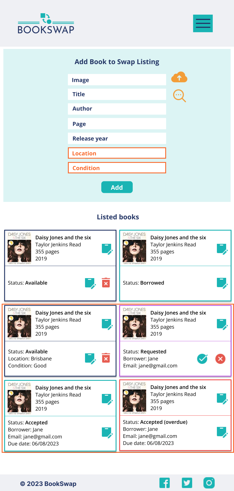    |  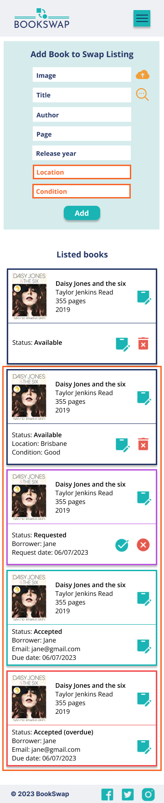      |

As per our previous agreement with Jozsef, following the data flow diagram and wireframing, user stories will be revised and updated as the next step.

## B - Wireframes updates

After reaching an agreement to implement an edit modal for book and listing details, high-level connections were promptly updated as follows.

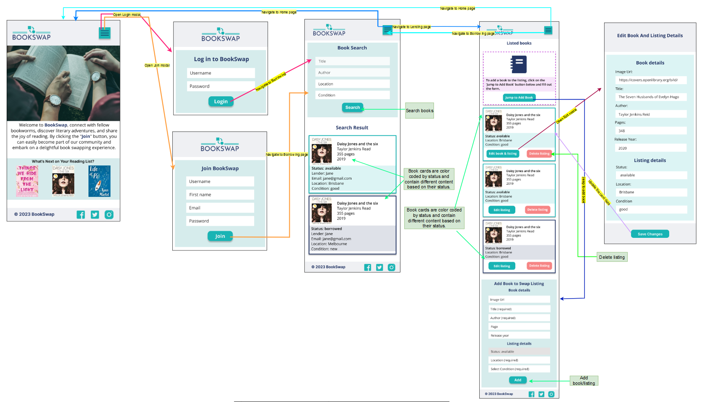

Note: Connections using prototyping are also defined in the Figma version.

### Home Page

The homepage did not change.

| Desktop | Tablet | Mobile |
|---------|--------|--------|
||        |        |

### Login and Join modal

Login and Join modal stayed the same, only the placeholders' color changed.

| Desktop | Tablet | Mobile |
|---------|--------|--------|
||  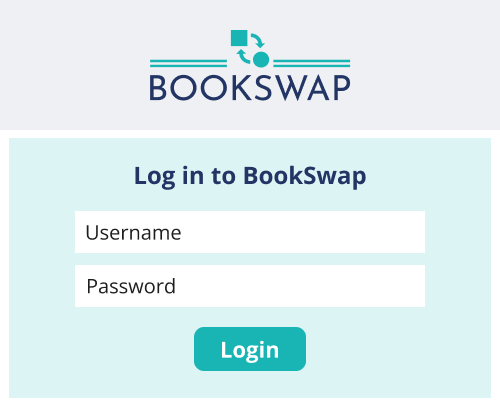      |        |

| Desktop | Tablet | Mobile |
|---------|--------|--------|
|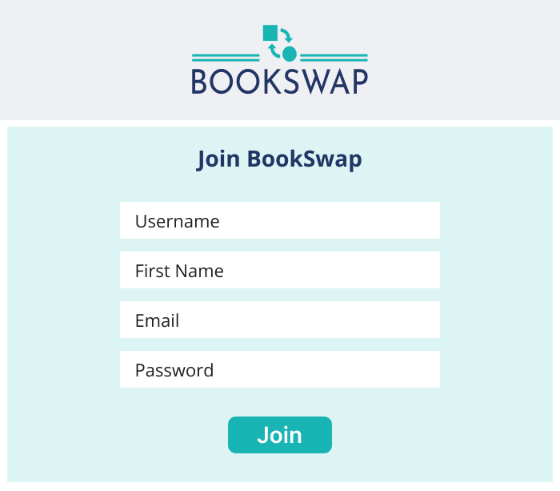|  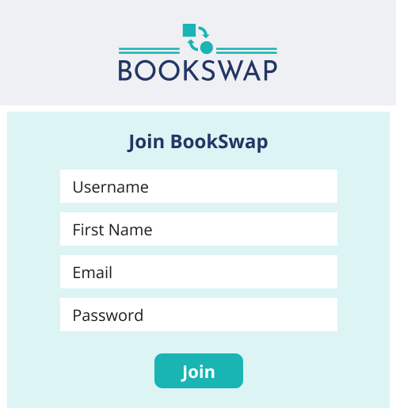    |        |

### Borrowing Page

During the development process of the borrowing page, the customer requested a couple of changes.

- The borrowing page's cards underwent a redesign, now containing more comprehensive information, all to enhance the convenience of borrowers.
- Additionally, there was a need to present borrowed items in search results, enabling borrowers to determine if a book is currently unavailable but might become accessible at a later stage. This feature ensures that borrowers are aware of the book's existence in the system, making it easier for them to plan their borrowing accordingly. 
- Depending on the status of the borrowing process (available or borrowed), the cards dynamically present different colors, allowing for easy visual identification.

| Desktop | Tablet | Mobile |
|---------|--------|--------|
|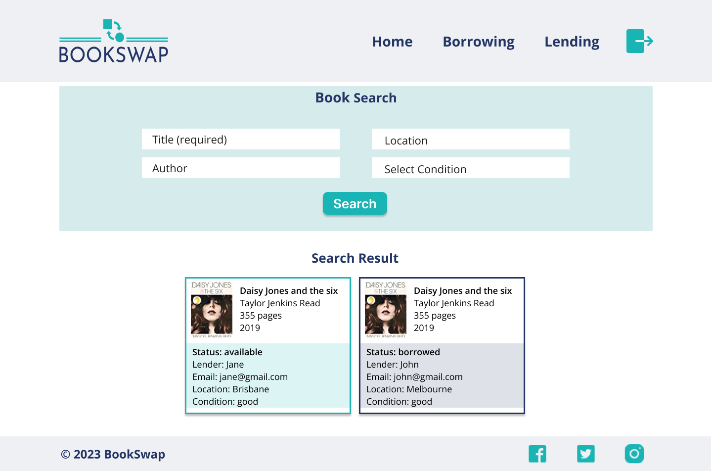|      |  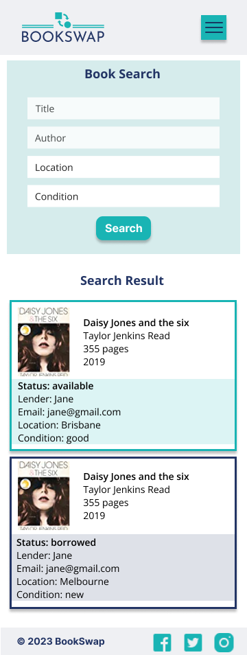      |

### Lending Page

During the development process of the lending page, the customer requested a couple of changes.

- The first request was to modify the order of the card list and add a book-to-listing form.
- To address the issue of cluttered cards in editing mode and better manage changes, it was decided to implement an edit book and listing data modal. Consequently, the cards underwent a redesign to ensure clarity and improved functionality.
- In response to the customer's requirements, a new card was introduced to provide users with information on how to add a book to the listing. Upon clicking the button, users would be directed to the relevant section of the form. This feature was necessary as when many books are listed, the form can not be seen on the screen.
- The application was designed to ask for minimal information about the book: title and author. If the book was already present in the database, the image, page count, and release year data will be automatically displayed on the updated card list. In case the book was not previously added, users have the option to modify the book details through the displayed card edit button and add additional information.
- The customer emphasized the importance of the book's title and author as essential information. Additionally, unique listing details, such as location, condition, and availability of the book, were also made required. When a book is added, its availability status is automatically set to "available."
- Users have the ability to delete a listing, but the application ensures that only the listing is deleted, not the book information itself.
- To make the card system more intuitive, color-coding was implemented based on different states.
- Furthermore, the system was designed to allow only the creator of the book to modify its details. For other users, only the "edit listing" button is available in the modal, and its content adjusts accordingly.

Overall, these changes and features were implemented to enhance the user experience and make the lending page more user-friendly and efficient.

| Desktop | Tablet | Mobile |
|---------|--------|--------|
|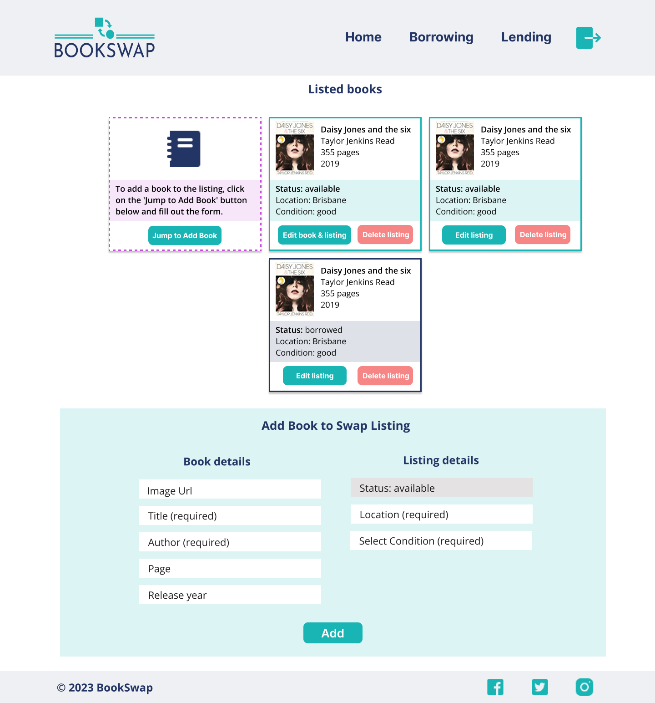|      |        |

### Edit Modal

The Edit Modal was introduced to enable users to edit both book and listing details. As mentioned earlier, the modal dynamically displays different information depending on the user's rights. If the user has added the book to the database, they can modify the book data. Conversely, if the user has only added the book to the listing, they are allowed to change only the listing information.

| Desktop | Tablet | Mobile |
|---------|--------|--------|
||      |        |

## R6 - Trello Board

[BookSwap Trello Board](https://trello.com/b/BfJSkwUq/bookswap)

Initial setup of the Trello Board for the documentation of the project.

The following working day the documentation progress

After the discussions on user stories, the Trello Board was established, incorporating the agreed-upon user stories.

These screenshots illustrate the progress I made on the tasks outlined for the readme file, including the creation of the data flow diagram, application architecture, and wireframes.

As mentioned previously, the user stories underwent refinement during the creation of the DFD diagram and wireframes, leading to updates and improvements.

Following that, the Trello Board was refreshed with the requirements specific to Assessment B.

Difficulty levels were assigned to the technical stories and later to user stories and requirements to provide a clear definition of their complexity.

Subsequently, both the backend and frontend structures were established.

The following day, I began working on the login and join functions. Initially, I created the backend, followed by incorporating the frontend elements such as the NavBar and buttons to initiate the authentication process. The progress of these tasks is represented by the displayed cards below.

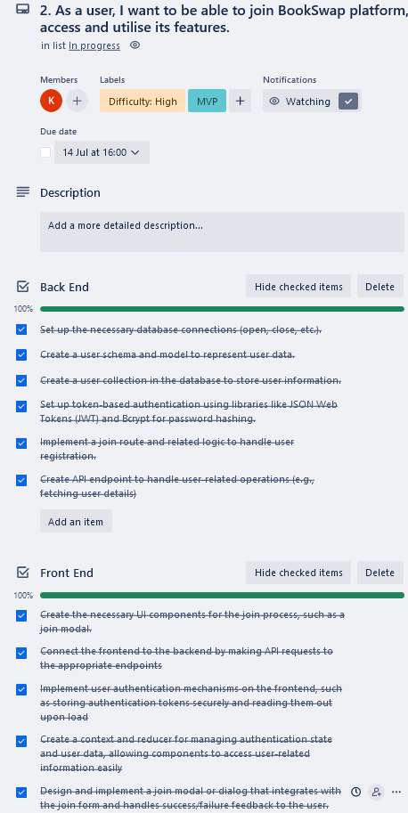

## B - Trello Board Updates

Trello was continued to us as task delegation with tickets assigned to me labelled with difficulty level and corresponding Git commits, so Jozsef was able to track the project progress and visually see what I was talking about during out daily standups.

The application was deployed early to resolve issues as soon as possible regarding the deployment.

Following the deployment, I concluded the Home page implementation.

For the next sprint these user stories were setup and their progress tracked as can be seen below.

The subsequent sprint setup was designed to accommodate a higher task volume within the week, leveraging the foundational work laid out in the preceding user stories. These tasks were tracked as follows.

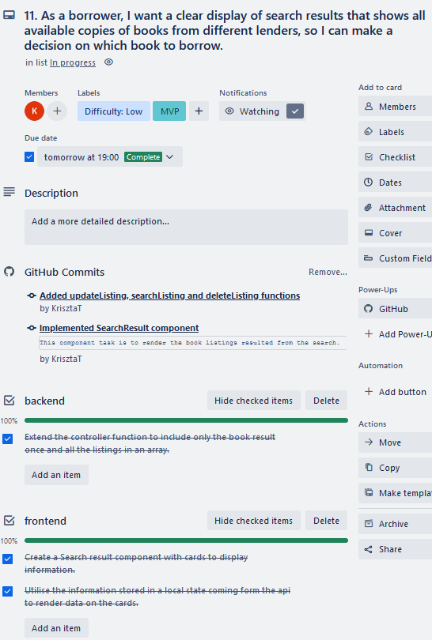

As per the agreed upon strategy post-MVP development, supplementary advanced tasks were incorporated into the development pipeline. Capitalising on new insights, two user stories were introduced to elevate the overall user experience. These user stories were evolved as can be seen below.

During the concluding sprint, the focus shifted towards backend refactoring, encompassing database seeding and comprehensive testing. Additionally, accepted change requests were developed, and subsequent fixes resulting from the test outcomes were addressed.

