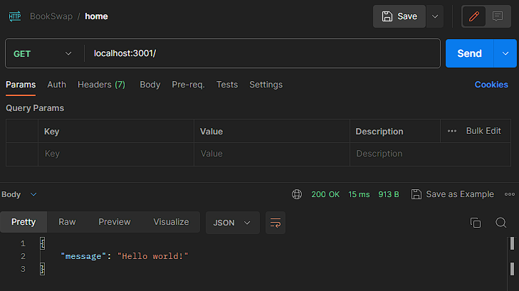
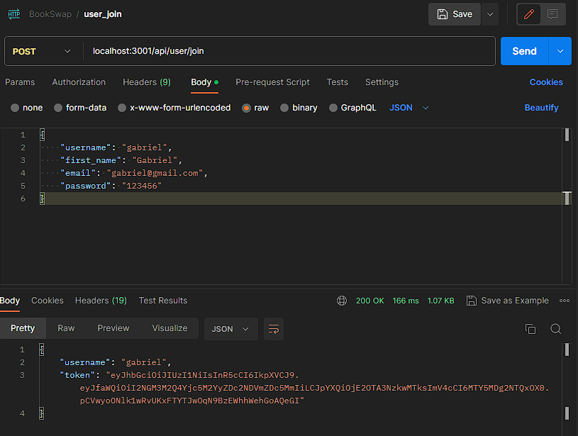
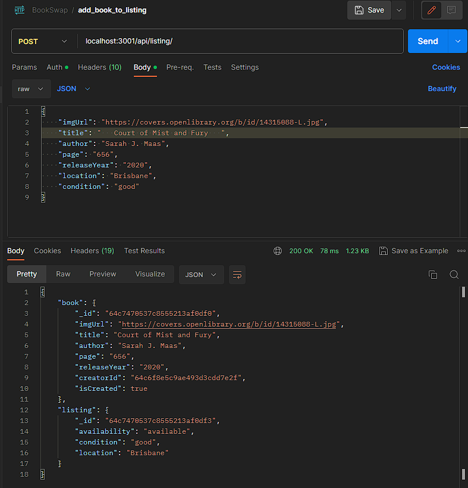
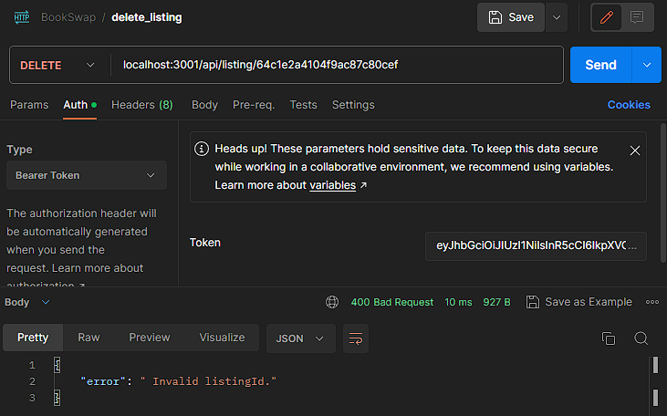
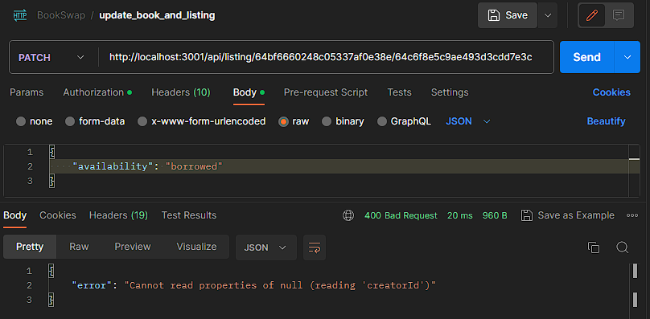

# **Development backend test using Postman**

Postman was extensively used to test the development server routing.

**To open the section and find the corresponding test images, simply click on the triangle icon in front of to the path or the path itself.**

 GET localhost:3001 

### Successful get localhost

### Invalid route

 POST localhost:3001/api/user/join 

### Successful join

### Unsuccessful join as a result of validation errors

### Unsuccessful join as a result of missing data

### Unsuccessful join as a result of existing data

 POST localhost:3001/api/user/login 

### Successful login

### Unsuccessful login as a result of incorrect data

### Unsuccessful login as a result of missing data

 POST localhost:3001/api/listing/ 

### Successful book and listing creation

### Unsuccessful book and listing creation as a result of token issues

### Unsuccessful book and listing creation as a result of validation errors

### Unsuccessful book and listing creation as a result of missing data

### Unsuccessful listing creation as a result of exiting listing

 GET localhost:3001/api/listing/ 

### Successful listing

### Unsuccessful listing as a result of token issues

 GET localhost:3001/api/listing/search?title=Court of Mist and Fury&condition=good 

### Successful search

### Unsuccessful search as a result of token issues

### Unsuccessful search as a result of missing title

### Unsuccessful search, no result found

 DELETE localhost:3001/api/listing/64c7470537c8555213af0df3 

### Successful delete

### Unsuccessful delete as a result of token issues

### Unsuccessful delete as a result of invalid listingId

 PATCH http://localhost:3001/api/listing/64bf6660248c05337af0e38e/64c6f8e5c9ae493d3cdd7e3c 

### Successful update

### Unsuccessful update as a result of token issues

### Unsuccessful search as a result of invalid ids

